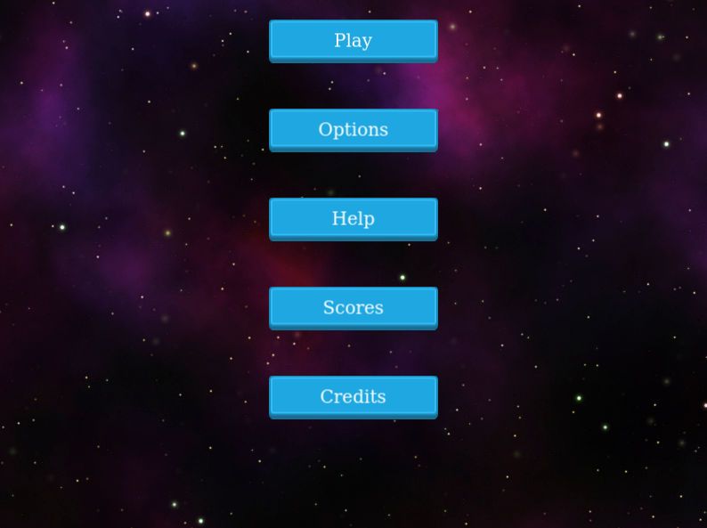

# SPACE WARS
Space Wars is a javascript arcade space-shooter made using the Phaser 3 Framework.

# Game



# Live version
[Live version](https://kwizl.github.io/space-shooter/)

## Overview

The goal of the game is to destroy as many enemies and asteroids as possible without getting killed. When the player shoots an enemy, they get 20 points on their score, while shooting an asteroid is 5 points. The spaceship is controlled by moving the arrow keys `up, down, right, and left` to move as desired. To shoot the lasers at the enemies or asteroids, press the keyboard `spacebar`.

## Design overview

The initial design for the game is a maneuvering game while shooting. The movement of the player spaceship, enemy spaceship, and the asteroids move along the y-axis since having them move across the screen in the x-axis brought about a lot of complexity to the player experience.

### Obstacles
The obstacles that the player has to encounter are the enemy spaceships and the asteroids. The asteroids and the spaceships fall across the screen towards the player. The player has to destroy them by firing lasers or avoid getting hit by them. Initially, the asteroids move haphazardly across the screen. Accomplishing this was difficult since time was not enough. However, I was able to make the asteroids to fall from the top of the screen.

### Future additions
Future additions may include the addition of game levels. There would also be a choice in the options scene for setting the level of difficulty for the game.

### Feedback
If there is a new feature that you feel the game should have, you can reach me via the contacts below.

#### Get a local copy
Now, if you need a copy of this application, if you are using Git, enter the following commands:
```js
git clone git@github.com:kwizl/space-shooter.git
```
Otherwise, just hit (Download Zip) on the green button (Clone or Download) on this page.

#### Run App
To run the application on your browser:
- Open your command prompt or terminal and navigate inside the downloaded project
- Type in the terminal: `npm install`
- Type in the terminal: `npm run start`
- Go to `http://localhost:8000/`
- Click on the build folder

## Requirements
- Node.js v14.12.0
- npm 6.14.8

## Acknowledgements and credits
This game uses 100% free and open assets thanks to the community over at **OpenGameArt** and **Unity Store**. Here are the authors of the assets used in this game:

- [Unity Store](), Game music.
- [para](https://opengameart.org/content/low-poly-rocks), Asteroid
- [Bleed](https://opengameart.org/users/bleed), Explosion animation.
- [Rawdanitsu](https://opengameart.org/users/rawdanitsu), Laser sprite.
- [MillionthVector](https://opengameart.org/content/set-faction5-spaceships), Spaceships

## Author

👤 **Martin Njoroge**

- Github: [@kwizl](https://github.com/kwizl)
- Twitter: [@NjoroKaris](https://twitter.com/NjoroKaris)
- Linkedin: [Martin Njoroge](https://www.linkedin.com/in/martin-kariuki-njoroge/)

## Contributing

Contributions, issues, and feature requests are welcome!

Feel free to check the [issues page](issues/).
